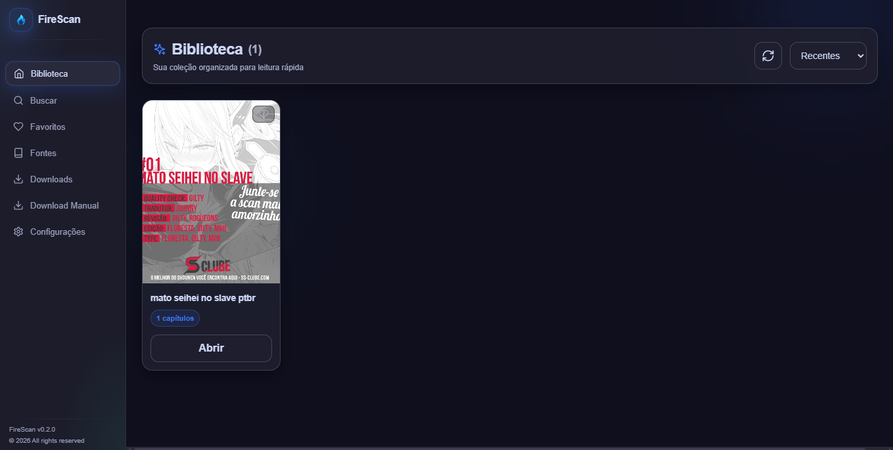

# FireScan

Aplicação desktop para buscar, baixar, organizar e ler mangás/manhwas localmente no Windows.

## Sobre o projeto

O FireScan surgiu com foco em automação de coleta (scrapping de dados) e organização de conteúdo de mangás, com prioridade em utilizar fontes diversas em um aplicativo, com extração do links estáticos refentes aos mangás disponibilizados. A motivação inicial para a criação do projeto foi um desafio pessoal de criar um app Windows que fosse capaz de fazer scrapping web.

Hoje, o projeto entrega uma interface gráfica para:

1. Buscar títulos em fontes suportadas.
2. Baixar capítulos para uso local.
3. Gerenciar biblioteca, favoritos e progresso de leitura.
4. Ler capítulos (CBZ/ZIP) diretamente no app.

## Imagem do projeto




## Como executar o projeto (modo usuário)

Este é o fluxo principal para quem só quer usar o app.

### Pré-requisitos

1. Windows 10/11.
2. Git Bash instalado (para clonar o projeto): https://git-scm.com/downloads
3. WebView2 Runtime (se não tiver no seu Windows): https://developer.microsoft.com/microsoft-edge/webview2/

### Passo a passo

1. Abra o Git Bash.

2. Clone o repositório:

```bash
git clone https://github.com/juankalleo/fire-scan.git
cd FireScan
```

3. Instale como aplicativo do Windows (recomendado):

- Dê duplo clique em `FireScan-instalador.msi`
- Siga o assistente de instalação
- Depois abra o FireScan pelo menu Iniciar

4. Ou, se preferir usar sem instalar:

- Dê duplo clique em `FireScan.exe`
ou
- Dê duplo clique em `FireScan_new.exe`


### Pasta da biblioteca no primeiro uso

Ao abrir o app pela primeira vez, ele cria e usa por padrao:

`C:\mangás`

Voce pode alterar em:

`Configuracoes` > `Localizacao da Biblioteca`

Depois de confirmar, o app passa a usar imediatamente o novo caminho.

## Estrutura resumida

```text
FireScan/
  src-tauri/   -> backend (Rust/Tauri)
  src-ui/      -> frontend (React/TypeScript)
  FireScan.exe -> executavel pronto para uso
```

## Solucao de problemas

### Erro ao abrir o app no Windows

1. Verifique se o WebView2 Runtime esta instalado.
2. Execute o `.exe` como administrador uma vez para testar permissoes.


## Observacao

Se voce clonou o repositorio apenas para usar o app, o caminho recomendado e sempre abrir o `FireScan.exe` diretamente.

## Tecnologias utilizadas

TypeScript: Linguagem usada no frontend da aplicação.

React: Biblioteca usada para construir a interface.

Vite: Ferramenta de build e desenvolvimento do frontend.

Node.js + npm: Ambiente e gerenciador de pacotes para instalar dependências e gerar build do app.

Tauri: Framework desktop usado para empacotar a aplicação em `.exe`.

Rust: Linguagem usada no backend desktop (comandos, leitura da biblioteca, integrações e regras de negócio).

SQLite (via `sqlx`): Banco local para catálogo, favoritos, progresso e metadados.

Tokio: Runtime assíncrono usado no backend Rust.

Tailwind CSS: Estilização da interface.

## Base de download

O FireScan usa como base de download o **Kotatsu**, através do **`kotatsu-dl`** (`kotatsu-dl.jar`) integrado ao app.
